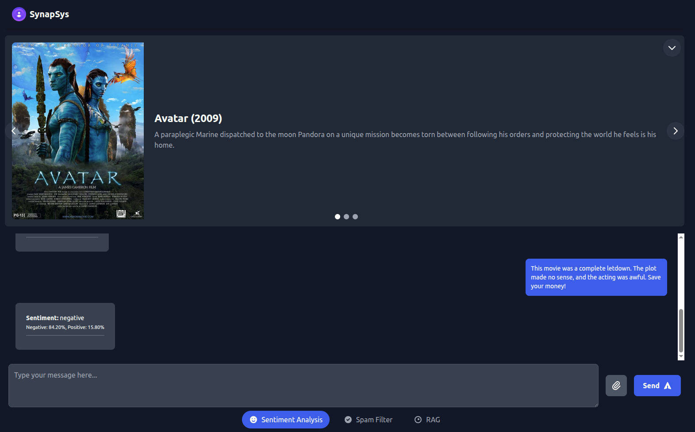
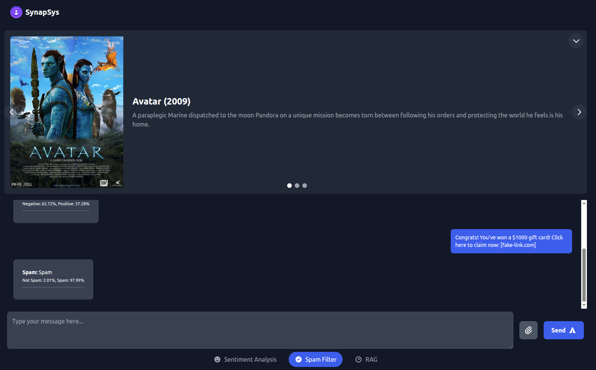
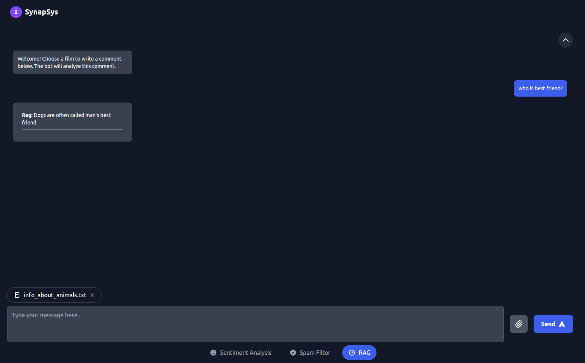

# SynapSys - NLP Playground

This project is a web-based application that provides a playground for various Natural Language Processing (NLP) tasks. It's designed to showcase practical applications of NLP and machine learning, demonstrating skills in building and deploying AI-powered tools.

## Live Demo

http://synapsys.website/

## Sentiment Analysis:



## Spam filter:



## RAG test with uploaded file as source data:



## Features

*   **Interactive Chat Interface:** A clean and simple chat interface to interact with the different NLP models.
*   **Multiple NLP Modes:**
    *   **Sentiment Analysis:** Provides real-time sentiment predictions (positive or negative) for the user's input, along with probability scores.
    *   **Spam Filter:** Predicts whether a given text is spam or not, with probability scores.
    *   **Retrieval-Augmented Generation (RAG):** Allows users to upload a document (TXT, PDF, or CSV) and ask questions about its content.
*   **File Upload:** Users can upload documents for the RAG model to process.
*   **RESTful API:** A Flask-based backend provides a `/predict` endpoint for all NLP tasks.

## Technologies Used

*   **Backend:**
    *   **Flask:** A lightweight web framework for Python.
    *   **scikit-learn:** For the machine learning models (Logistic Regression).
    *   **LangChain:** For building the RAG pipeline.
    *   **ChromaDB:** For storing vector embeddings for the RAG model.
    *   **Hugging Face Transformers:** For using pre-trained models for text embeddings and generation.
    *   **Kaggle:** For the datasets used to train the models.
    *   **Pandas & NumPy:** For data manipulation and numerical operations.
*   **Frontend:**
    *   **HTML5 & CSS3 (Tailwind CSS):** For the structure and styling of the web interface.
    *   **JavaScript (Alpine.js):** For handling user interaction and API communication.
*   **Machine Learning Models:**
    *   **BERT (Bidirectional Encoder Representations from Transformers):**  A powerful pre-trained model (`prajjwal1/bert-tiny`) is used to generate contextual embeddings for sentiment and spam analysis.
    *   **Logistic Regression:** Simple yet effective classification models are trained on top of the BERT embeddings to predict sentiment and spam.
    *   **Google Generative AI:** Effective LLM model for RAG.


## How It Works

1.  **User Input:** The user selects a mode, enters text, and optionally uploads a file.
2.  **API Request:** The frontend sends the data to the Flask backend via a POST request to the `/predict` endpoint.
3.  **Model Selection:** The backend selects the appropriate model based on the chosen mode.
4.  **Prediction:**
    *   **Sentiment/Spam:** The text is converted into a BERT embedding, which is then fed to the corresponding classification model.
    *   **RAG:** The uploaded document is loaded, split into chunks, and converted into embeddings. These embeddings are stored in a ChromaDB vector store. The user's question is then used to retrieve relevant chunks from the document, which are then fed to the `gemini-2.5-pro` model to generate an answer.
5.  **API Response:** The backend sends the prediction back to the frontend.
6.  **Display Results:** The frontend displays the model's output in the chat interface.


## Setup and Installation

1.  **Clone the repository:**
    ```bash
    git clone https://github.com/kevasesk/synapsys.git
    cd synapsys
    ```

2.  **Create and activate a virtual environment:**
    ```bash
    python -m venv .venv
    source .venv/bin/activate
    ```

3.  **Install the dependencies:**
    ```bash
    pip install -r requirements.txt
    ```

4.  **Run the application:**
    ```bash
    python app.py
    ```
    The application will be available at `http://127.0.0.1:5000`.

## Future Improvements

*   **Use more advanced models:** Experiment with larger models for potentially higher accuracy.
*   **Expand the sentiment classes:**  Include "neutral" as a possible sentiment.
*   **Add user authentication:** Allow users to have their own chat history.
*   **Implement a database:** Store chat history and user data.
*   **Improve RAG:** Implement more advanced RAG techniques, such as using a more powerful generator model or a more sophisticated retriever.
