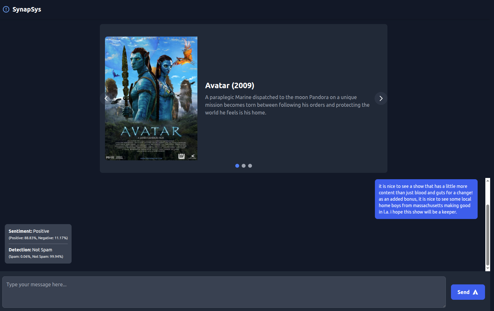

# SynapSys - Sentiment Analysis Web App

This project is a web-based application that performs sentiment analysis on user-provided text. It's designed to showcase a practical application of Natural Language Processing (NLP) and machine learning, demonstrating skills in building and deploying a simple AI-powered tool.

## Live Demo

http://synapsys.website/



## Features

*   **Interactive Chat Interface:** A clean and simple chat interface to interact with the sentiment analysis model.
*   **Real-time Predictions:** The model provides real-time sentiment predictions (positive or negative) for the user's input.
*   **Probability Scores:**  Displays the model's confidence in its prediction, showing the probability for both positive and negative sentiments.
*   **RESTful API:** A Flask-based backend provides a `/predict` endpoint for sentiment analysis.

## Technologies Used

*   **Backend:**
    *   **Flask:** A lightweight web framework for Python.
    *   **scikit-learn:** For the machine learning model (Logistic Regression).
    *   **Hugging Face Transformers:** For using the pre-trained BERT model for text embeddings.
    *   **Kaggle:** For the dataset used to train the model.
    *   **Pandas & NumPy:** For data manipulation and numerical operations.
*   **Frontend:**
    *   **HTML5 & CSS3 (Tailwind CSS):** For the structure and styling of the web interface.
    *   **JavaScript:** For handling user interaction and API communication.
*   **Machine Learning Model:**
    *   **BERT (Bidirectional Encoder Representations from Transformers):**  A powerful pre-trained model (`prajjwal1/bert-tiny`) is used to generate contextual embeddings from the input text.
    *   **Logistic Regression:** A simple yet effective classification model is trained on top of the BERT embeddings to predict the sentiment.

## How It Works

1.  **User Input:** The user enters a piece of text into the chat interface.
2.  **API Request:** The frontend sends the text to the Flask backend via a POST request to the `/predict` endpoint.
3.  **Text Preprocessing:** The backend preprocesses the text (e.g., converting to lowercase).
4.  **BERT Embeddings:** The pre-trained BERT model from Hugging Face tokenizes the text and generates a vector representation (embedding) that captures the semantic meaning of the text.
5.  **Sentiment Prediction:** The trained Logistic Regression model takes the BERT embedding as input and predicts the sentiment (positive or negative). It also calculates the probabilities for each class.
6.  **API Response:** The backend sends the prediction and probabilities back to the frontend as a JSON response.
7.  **Display Results:** The frontend displays the model's prediction and the associated probabilities in the chat interface.


## Setup and Installation

1.  **Clone the repository:**
    ```bash
    git clone https://github.com/kevasesk/synapsys.git
    cd synapsys
    ```

2.  **Create and activate a virtual environment:**
    ```bash
    python -m venv .venv
    source .venv/bin/activate
    ```

3.  **Install the dependencies:**
    ```bash
    pip install -r requirements.txt
    ```

4.  **Run the application:**
    ```bash
    python app.py
    ```
    The application will be available at `http://127.0.0.1:5000`.

## Future Improvements

*   **Use a more advanced model:** Experiment with larger BERT models or other architectures for potentially higher accuracy.
*   **Expand the sentiment classes:**  Include "neutral" as a possible sentiment.
*   **Add user authentication:** Allow users to have their own chat history.
*   **Implement a database:** Store chat history and user data.
